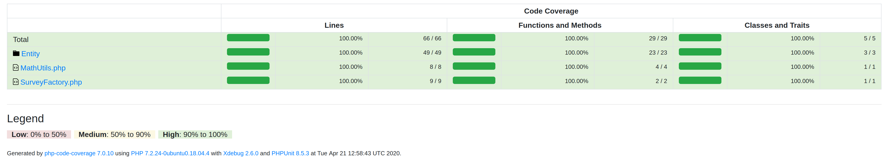
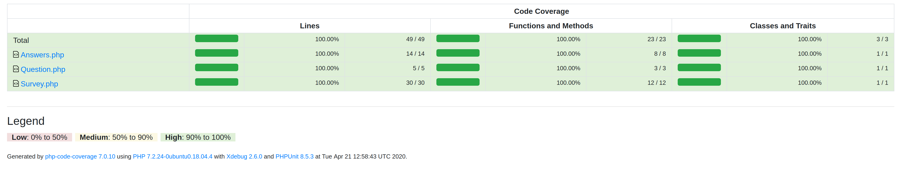
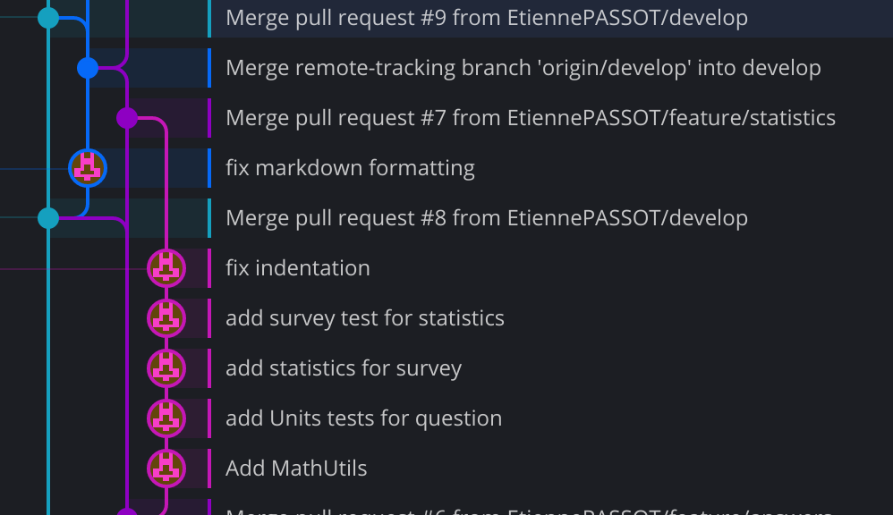
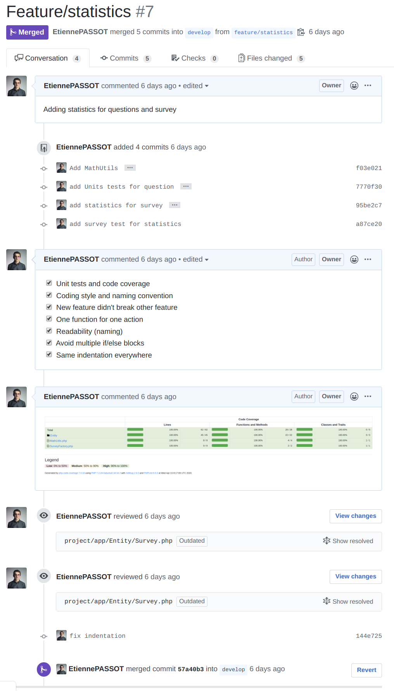

# SQA-FinalAssignement
---
## Sprint Backlog

All goals of tasks will be tests before commit.

### Sprint 1

>Task : **project initialization**
>Goal : 
>- Folder structure
>
>Time : 1 hour

>Task : **unit test installation**
>Goal : 
>- Choose tools to make unit tests
>- Install unit tests tool in the project
>- Choose code coverage tools
>- Install code coverage tool in the project
>
>Time : 40 min

>Task : **Set up a survey (max 10 questions)**
>Goal :
>- Create Survey class
>- Add list of Questions class
>- Add list of Answer class
>- Add name of Survey
>- Create SurveyFactory class to manage all Surveys
>
>Time : 1 hour

>Task : **Search survey by name**
>Goal : 
>- Add method to SurveyFactory to get survey by name
>
>Time : 30 min

>Task : **Create Question**
>Goal : 
>- Create Question class
>- Add Question String
>- Link Question to Survey
>
>Time : 20 min

>Task : **Create Answer**
>Goal : 
>- Create Answer class
>- Link Answer class to Question class (Question class have list of Answer)
>- Add list of mark (from 0 to 5)
>
>Time : 1:20 h

### Sprint 2

>Task : **Calculate the average, standard deviation, minimum score, maximum score for Answer.**
>Goal : 
>- Calculate average of Answer
>- Calculate Standard deviation of Answer
>- Get minimum score of Answer
>- Get maximum score of Answer
>
>Time : 1:30 h

>Task : **Calculate the average, standard deviation, minimum score, maximum score for Survey.**
>Goal : 
>- Calculate average of Survey
>- Calculate Standard deviation of Survey
>- Get minimum score of Survey
>- Get maximum score of Survey
>
>Time : 1:30 h


>Task : **Get all answers from Survey**
>Goal : 
>- Get All answers from survey
>
>Time : 20 min

---
### Test Driven

Unfortunately, I didn't understand the "test driven" translation in French before developing the project. So I will explain the interest of this process but I won't have an example.

The principle of test-driven is to write the unit tests before developing the feature. This process allows to have a different approach in the realization of a feature and to meet all the needs that the feature must complete.
The resulting software is both designed to meet the need accurately and to do so with minimal complexity. The result is software that is better designed, better tested and more reliable, in other words, of better quality.

---
### Test Coverage

Test coverage are made with PHPunit and can be launched like this (after install all packages)
```
./vendor/phpunit/phpunit/phpunit tests/ --coverage-html coverage --whitelist app/
```

Here, you can see the result of test coverage:



---
### GitFlow

For the smooth running of this project, I followed the GitFlow process.

The Develop branch describes the development phases with the addition of features.
Each feature is developed in a separate branch (for example: features/statistics, features/answersFromSurvey, features/documentation) and then merged into the Develop branch.
When a stable version is ready on Develop, it is merged into Master.
The Master branch only describes stable releases. All merges on this branch are described by a tag which is a functional version of the project.
If we encounter a bug, we create a hotfix branch named to describe the version change (example: v1.0.0 -> v1.0.1 so the branch will be named v1.0.1) then it is merged in Master and in Develop.



Here you can see part of the GitFlow process.

In Light Blue: Master
In Dark Blue: Hotfix
In Violet: Develop
En Rose : Feature

In chronological order, the Feature branch described by the pink commits is under development.
Meanwhile, the Develop branch is merged into master. A Hotfix branch is opened from master which is then merged into master and into Develop. The Feature is also merged into Develop.


---
### Code Review Checklist

- [ ] Unit tests and code coverage
- [ ] Coding style and naming convention
- [ ] New feature didn't break other feature
- [ ] One function for one action
- [ ] Readability (naming)
- [ ] Avoid multiple if/else blocks
- [ ] Same indentation everywhere

exemple of pull request :
[Pull-request 1](https://github.com/EtiennePASSOT/SQA-FinalAssignement/pull/5)
[Pull-request 2](https://github.com/EtiennePASSOT/SQA-FinalAssignement/pull/6)
[Pull-request 3](https://github.com/EtiennePASSOT/SQA-FinalAssignement/pull/7)

**Explanation of PR 3 :**

A pull-request has been requested for merge Feature/statistics in develop.

We add the checklist in the pull-request and check the boxes one by one checking all the requested information in all the files. (here, we can see the proof of code coverage)

There are two indentation errors found by the reviewer.
The author of the pull request corrects the errors.
The reviewers recheck all points on the changes made by the new commit.
If everything is checked and committed, then the PR can be merged into the Develop branch.

